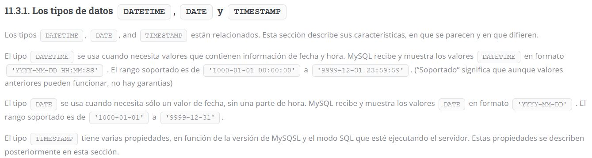

# Creación de todas las relaciones.

## Para las fechas tener en cuenta:




---

## Relación matricula

<center>


</center>C:\wamp64\www\TrabajoFinal\TrabajoFinalBasesDeDatos

```sql
CREATE TABLE matricula(
			placa_identificacion VARCHAR(7) PRIMARY KEY
				CHECK (placa_identificacion LIKE '___'||'-'||'___'),
			fecha_vencimiento_seguro DATE NOT NULL,
			modelo VARCHAR(10) NOT NULL,
			lugar_compra_vehiculo VARCHAR(15) NOT NULL,
			marca VARCHAR(10) NOT NULL,
			tipo VARCHAR(1) NOT NULL 
    			CHECK(tipo in('T','B'))
			);
```

## Relación despachador

<center>


</center>

```sql
CREATE TABLE despachador(
			 numero_identificacion NUMBER(15) PRIMARY KEY,
			 primer_nombre VARCHAR(10) NOT NULL,
			 segundo_nombre VARCHAR(10),
			 primer_apellido VARCHAR(10) NOT NULL,
			 segundo_apellido VARCHAR(10),NUMBER
    		 edad NUMBER(2) NOT NULL 
                CHECK(edad>18),
			 telfono_celular NUMBER(10) UNIQUE NOT NULL
			 );
```

## Relación destino

<center>


</center>

```sql
CREATE TABLE destino(
		     codigo NUMBER(10) PRIMARY KEY,
		     coordenada_GPS VARCHAR(30) NOT NULL,
		     direccion_destino VARCHAR(30),
		     facha_y_hora_llegada TIMESTAMP
		     );
```

## Relación mecánico

<center>


</center>

```sql
CREATE TABLE mecanico(
	 	      numero_identificacion NUMBER(15) PRIMARY KEY,
		      primer_nombre VARCHAR(10) NOT NULL,
		      segundo_nombre VARCHAR(10),
		      primer_apellido VARCHAR(10) NOT NULL,
		      segundo_apellido VARCHAR(10),
		      lugar_estudios VARCHAR(20) NOT NULL,
		      
    		  tipo_sangre VARCHAR(3) NOT NULL 
    			CHECK(tipo_sangre IN ('A+','A-','B-','B+','0+','0-','AB+','AB-')),

    		  seguro_vida NUMBER(1) NOT NULL 
    			CHECK(seguro_vida IN(0,1)),
    
    		  edad NUMBER(2) NOT NULL 	
    			CHECK(edad>18),
		      tipo_mecanico VARCHAR(4) NOT NULL 
    			CHECK(tipo_mecanico IN('Taxi','Bus'))
		      );
```

## Relación chofer

<center>


</center>

```sql
CREATE TABLE chofer(
	numero_identificacion NUMBER(15) PRIMARY KEY,
	primer_nombre VARCHAR(10) NOT NULL,
	segundo_nombre VARCHAR(10),
	primer_apellido VARCHAR(10) NOT NULL,
	segundo_apellido VARCHAR(10),
	fecha_de_naciemiento DATE NOT NULL,
	fecha_expiracion_pase DATE NOT NULL,
	telfono_celular NUMBER(10) UNIQUE NOT NULL,
    tipo_sangre VARCHAR(3) NOT NULL 
        CHECK(tipo_sangre IN ('A+','A-','B-','B+','0+','0-','AB+','AB-')), 
	
	salario NUMBER(4) NOT NULL
		CHECK(salario > 0),
    
	placa_bus VARCHAR(7) REFERENCES bus,
    placa_taxi VARCHAR(7) REFERENCES taxi,

        CHECK(
        (placa_bus IS NULL and placa_taxi IS NOT NULL) 
        OR
        (placa_bus IS NOT NULL and placa_taxi IS NULL )
        ),
	
	id_gremio VARCHAR(10) REFERENCES gremio,
	id_empresa_rival NUMBER(10) REFERENCES empresa_rival
    );
```

## Relación Bus

<center>


</center>

```sql
CREATE TABLE bus(
    placa_de_identificacion VARCHAR(7) PRIMARY KEY REFERENCES matricula(placa_identificacion),
    numero_de_pasajeros_de_pie_permitidos NUMBER(3),
    numero_de_asientos NUMBER(3) NOT NULL,
    fecha_de_compra DATE NOT NULL,
    fecha_de_ultimo_mantenimiento DATE,
    valor_de_compra NUMBER(7) NOT NULL,
    tarifa NUMBER(5) NOT NULL,

	-- Claves foráneas 
	midespachador NUMBER(15) NOT NULL REFERENCES despachador,
	idrevisor NUMBER(15) REFERENCES mecanico,
	idreparador NUMBER(15) REFERENCES mecanico,
	miruta VARCHAR(50) NOT NULL REFERENCES ruta,
		CHECK(idrevisor <> idreparador),
		CHECK(fecha_de_ultimo_mantenimiento >= fecha_de_compra)
);
```

## Relación Taxi

<center>


</center>

```sql
CREATE TABLE taxi(
    placa_de_identificacion VARCHAR(7) PRIMARY KEY REFERENCES matricula(placa_identificacion),
	fecha_compra DATE NOT NULL,
	fecha_ultimo_mantenimiento DATE,
	costo_carrera_minima NUMBER(5) NOT NULL,
	valor_de_compra NUMBER(8),
	ubicacion_actual VARCHAR(30) NOT NULL,

	-- Para el super tipo

	tipo VARCHAR(8) NOT NULL CHECK(tipo IN ('Lujo','Estandar')),
	-- CHECKS

	CHECK(fecha_ultimo_mantenimiento >= fecha_compra),
	CHECK(costo_carrera_minima >= 3500 AND costo_carrera_minima <= 4000),
);

-- Subtipos

CREATE TABLE taxi_de_lujo (
	placa_de_identificacion VARCHAR(7) PRIMARY KEY REFERENCES taxi (placa_identificacion),
	valor_añadido NUMBER(5) NOT NULL
);

CREATE TABLE taxi_estandar (
	placa_de_identificacion VARCHAR(7) PRIMARY KEY REFERENCES taxi(placa_identificacion)
);

```

## Relación cliente_vip

<center>


</center>

```sql
CREATE TABLE cliente_vip(
	numero_de_identificacion NUMBER(15) PRIMARY KEY,
	primer_nombre VARCHAR(10) NOT NULL,
	segundo_nombre VARCHAR(10),
	primer_apellido VARCHAR(10) NOT NULL,
	segundo_apellido VARCHAR(10),
	fecha_nacimiento DATE NOT NULL,
	tipo_sangre VARCHAR(3) NOT NULL 
        CHECK(tipo_sangre IN ('A+','A-','B-','B+','0+','0-','AB+','AB-')),
	musica VARCHAR(30),
	temperatura_de_preferencia_del_aire_acondicionado NUMBER(2)
		CHECK(temperatura_de_preferencia_del_aire_acondicionado > 0 AND
		temperatura_de_preferencia_del_aire_acondicionado < 25),
	taxi_de_lujo VARCHAR(7) REFERENCES taxi_de_lujo
);
```

## Relación ruta

<center>


</center>

```sql
CREATE TABLE ruta(
	nombre VARCHAR(30) PRIMARY KEY
		CHECK(nombre LIKE '___'||'-'||'___'),
	numero_de_paraderos_fijos NUMBER(2) NOT NULL,
	distancia_en_kilometros NUMBER(3,2),
	media_de_pasajeros NUMBER(5),
	tiempo_medio_de_duracion_de_la_ruta NUMBER(3,2),
	ruta_larga VARCHAR(30) REFERENCES ruta
		CHECK(nombre <> ruta_larga)
);
```

## Relación gremio

<center>


</center>

```sql
CREATE TABLE gremio(
	nombre_gremio VARCHAR(30) PRIMARY KEY,
	ced_presidente_gremio NUMBER(15) UNIQUE NOT NULL,
	telefono_del_gremio NUMBER(10) UNIQUE NOT NULL,
);
```

## Relación empresa rival

<center>


</center>

```sql
CREATE TABLE empresa(
	NIT NUMBER(10) PRIMARY KEY,
	nombre VARCHAR(30) NOT NULL,
	valor_en_bitcoins_de_la_empresa NUMBER(5)
		CHECK(valor_en_bitcoins_de_la_empresa > 0),
	id_gremio VARCHAR(10) UNIQUE
);
```


